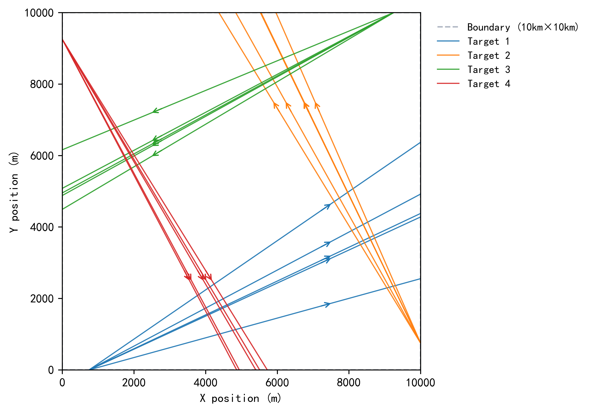

# Uncertain_MT-TSP_Benchmark_Dataset

## Introduction

This dataset contains multiple stochastic trajectories of numerous targets moving within a 10*10 km^2 area.
* Number of targets: 20, 40, 60, 80, 100 
* Number of stochastic trajectories: 5, 10

## Example

